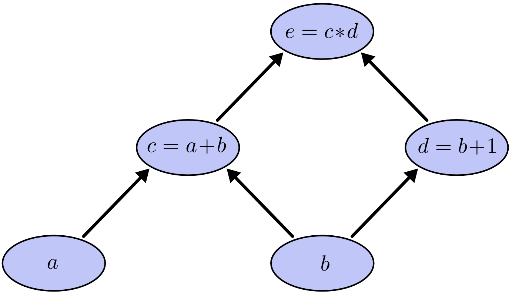
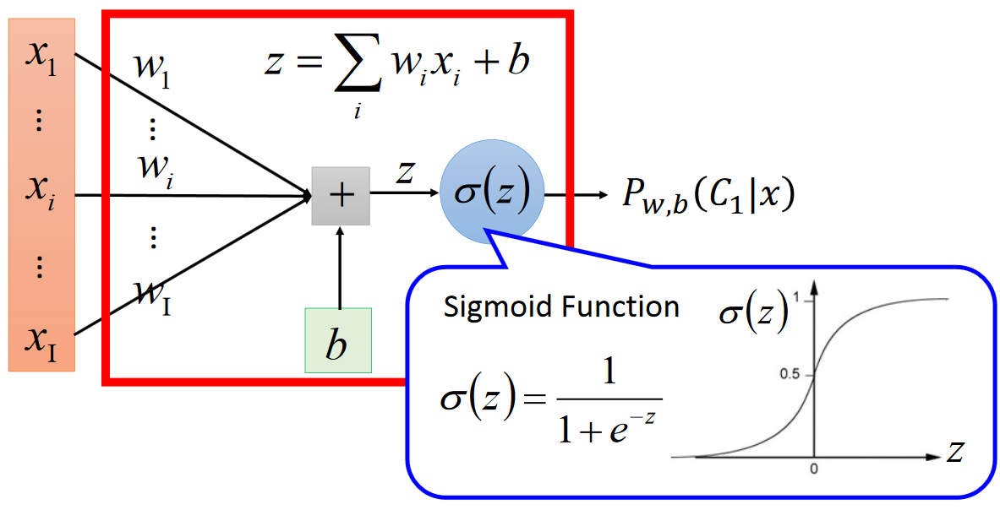

# Back Propagation

我理解的反向传播，包含两部分内容：链式法则+动态规划。
链式法则提供了一种计算偏导数的方法，而动态规划则进一步优化了计算，用空间换时间

## 1 链式法则

链式法则是微积分中的求导法则，用来求复合函数的偏导数。

### 1.1 标量

设 x 是实数，f 和 g 是从实数映射到实数的函数，令 y = g(x), z = f(g(x)) = f(y)

```math
\frac{dz}{dx} = \frac{dz}{dy} \frac{dy}{dx}
```

### 1.2 向量

```math
\frac{\partial z}{\partial x_i} = \sum_{j} \frac{\partial z}{\partial y_j} \frac{\partial y_j}{\partial x_i}
```

## 2 动态规划

动态规划的过程可以看出暴力搜索+空间换时间的优化过程

## 3 简单例子

通过一个简单的例子来说明如何进行反向传播

```math
e = (a + b) * (b + 1)
```

计算图如下：

<p></p>

令a=2, b=1，计算每个节点值并且利用偏导数的定义，求出不同层之间相邻节点的偏导数关系

<p></p>

利用链式法则我们知道：

```math
\frac{\partial e}{\partial a} = \frac{\partial e}{\partial c} \frac{\partial c}{\partial a}

\frac{\partial e}{\partial b} = \frac{\partial e}{\partial c} \frac{\partial c}{\partial b} + \frac{\partial e}{\partial d} \frac{\partial d}{\partial b} 
```

> (de/da)值等于从(a-c-e)的路径上的偏导数的乘积，而(de/db)等于从b到e的路径(b-c-e)上的偏导数的乘积加上路径(b-d-e)上的偏导数的乘积。

**对于上层节点p和下层节点q，需要找到从q节点到p节点的所有路径，并且对每条路径，求得该路径上的所有偏导数的乘积，然后将所有路径的乘积累加起来得到(dp/dq)**

如果对每个变量单独求偏导数，有冗余的过程(e-c的路径被访问了两次)。对于神经网络来说更是如此。所以为了减少计算，利用空间换时间，记录每个节点到根节点的偏导数

**所以反向传播算法对于每一个路径只访问一次就能求顶点对所有下层节点的偏导数**

## 4 逻辑回归

逻辑回归假设预测值y服从伯努利分布

<p></p>

### 4.1 代价函数推导

**(1) 概率表示**

```math
p(y=1|x;w) = \sigma(w^Tx+b) = \sigma(z)

p(y=0|x;w) = 1 - \sigma(z)

p(y|x;w) = \sigma(z)^y(1-\sigma(z))^{(1-y)}
```

**(2) 极大似然估计**

> 极大似然估计提供了一种**给定观察数据来评估模型参数**的方法，即：“模型已定，参数未知”。通过若干次试验，观察其结果，利用试验结果得到某个参数值能够使样本出现的概率为最大

```math
L(w) = \prod_{i=1}^mp(y^{(i)}|x^{(i)};w) = \prod_{i=1}^m(\sigma(z^{(i)})^{y^{(i)}}(1-\sigma(z^{(i)})^{1-y^{(i)}}
```

**(3) 代价函数**

两边取对数

```math
l(w) = lnL(w) = \sum_{i=1}^{n}y^{(i)}ln(\sigma(z^{(i)})) + (1-y^{(i)})ln(1-\sigma(z^{(i)}))
```

代价函数

```math
J(w) = -l(w) = -\sum_{i=1}^{n}y^{(i)}ln(\sigma(z^{(i)})) + (1-y^{(i)})ln(1-\sigma(z^{(i)}))
```

### 4.2 利用梯度下降法求参数

**梯度下降法**

```math
w = w - \eta \frac{\partial J(w)}{\partial w}
```

**求逻辑回归的偏导数**

```math
\frac{\partial J(w)}{w_j} = -\sum_{i=1}^m(y^{(i)} \frac{1}{\sigma(z^{(i)})} - (1-y^{(i)}) \frac{1}{1-\sigma(z^{(i)})}) \frac{\partial \sigma(z^{(i)})}{\partial w_j}

= -\sum_{i=1}^m(y^{(i)} \frac{1}{\sigma(z^{(i)})} - (1-y^{(i)}) \frac{1}{1-\sigma(z^{(i)})}) \sigma(z^{(i)})(1-\sigma(z^{(i)})) \frac{\partial z^{(i)}}{\partial w_j}

= -\sum_{i=1}^m(y^{(i)}(1-\sigma(z^{(i)}))-(1-y^{(i)})\sigma(z^{(i)}))x_j^{(i)}

= -\sum_{i=1}^m(y^{(i)}-\sigma(z^{(i)}))x_j^{(i)}
```

**更新参数**

```math
w_j = w_j + \eta\sum_{i=1}^m(y^{(i)}-\sigma(z^{(i)}))x_j^{(i)}
```

当样本量极大时，每次更新参数会非常耗时，这时可以采用随机梯度下降法，每次迭代时需要打乱样本，然后更新参数

```math
w_j = w_j + \eta(y^{(i)}-\sigma(z^{(i)}))x_j^{(i)},\ for\ i\ in\ range(m): 
```

也就是去掉了求和，针对每个样本进行更新

## 5 参考文献

- [如何直观地解释 backpropagation 算法](https://www.zhihu.com/question/27239198/answer/89853077)
- [Calculus on Computational Graphs: Backpropagation](http://colah.github.io/posts/2015-08-Backprop/)
- [逻辑回归的本质——极大似然估计](https://blog.csdn.net/zjuPeco/article/details/77165974)