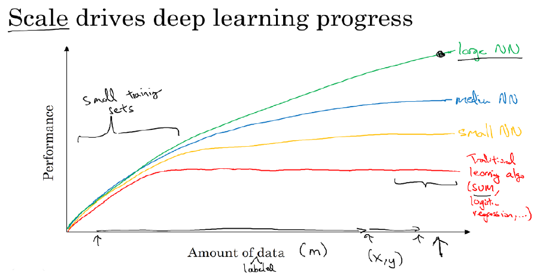

# Basic

<p></p>

## 1 激活函数

激活函数是用来加入非线性因素的，因为线性模型的表达能力不够

### 1.1 Sigmoid

```math
\sigma(x) = \frac{1}{1+e^{-x}}

\frac{\partial}{\partial x} \sigma(x) = \sigma(x) (1 - \sigma(x))
```

输入实数值将其挤压到0到1范围内，适合输出为概率的情况，只在网络最后一层出现

**问题**

- Sigmoid函数饱和使梯度消失
- Sigmoid函数的输出不是零中心的

### 1.2 Tanh

这是一个经过拉升的sigmoid函数

```math
tanh(x) = \frac{e^x-e^{-x}}{e^x+e^{-x}} = 2\sigma(2x) - 1
```

Tanh解决了Sigmoid的输出是不是零中心的问题，但仍然存在饱和问题

**为了防止饱和，现在主流的做法会在激活函数前多做一步batch normalization，尽可能保证每一层网络的输入具有均值较小的、零中心的分布**

### 1.3 ReLU

```math
relu(x) = max(0, x)
```

相较于sigmoid和tanh函数，ReLU对于随机梯度下降的收敛有巨大的加速作用；sigmoid和tanh在求导时含有指数运算，而ReLU求导几乎不存在任何计算量

**问题**

- ReLU单元比较脆弱并且可能“死掉”，而且是不可逆的，因此丢失了数据多样化。通过合理设置学习率，会降低神经元“死掉”的概率

## 2 初始化

## 3 损失函数(Loss)和代价函数(Cost)

## 4 参数和超参数