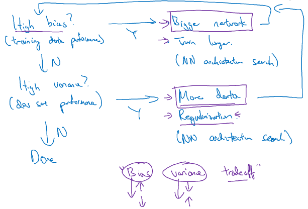

# Basic

<p></p>

## 1 激活函数

激活函数是用来加入非线性因素的，因为线性模型的表达能力不够

### 1.1 Sigmoid

```math
\sigma(x) = \frac{1}{1+e^{-x}}

\frac{\partial}{\partial x} \sigma(x) = \sigma(x) (1 - \sigma(x))
```

<p></p>

输入实数值将其挤压到0到1范围内，适合输出为概率的情况，只在网络最后一层出现

**问题**

- Sigmoid函数饱和使梯度消失
- Sigmoid函数的输出不是零中心的

### 1.2 Tanh

```math
tanh(x) = \frac{e^x-e^{-x}}{e^x+e^{-x}} = 2\sigma(2x) - 1

\frac{\partial}{\partial x}tanh(x) = 1 - tanh^2(x)
```

<p></p>

Tanh函数是一个经过拉升的sigmoid函数

Tanh解决了Sigmoid的输出是不是零中心的问题，但仍然存在饱和问题

**为了防止饱和，现在主流的做法会在激活函数前多做一步batch normalization，尽可能保证每一层网络的输入具有均值较小的、零中心的分布**

### 1.3 ReLU

```math
relu(x) = max(0, x)

\frac{\partial}{\partial x}relu(x)=\left\{\begin{array}{lc} 
		0 & n<0\\
		1 & n \geq 1\\
	\end{array}\right.
```

<p></p>

相较于sigmoid和tanh函数，ReLU对于随机梯度下降的收敛有巨大的加速作用；sigmoid和tanh在求导时含有指数运算，而ReLU求导几乎不存在任何计算量

**问题**

- ReLU单元比较脆弱并且可能“死掉”，而且是不可逆的，因此丢失了数据多样化。通过合理设置学习率，会降低神经元“死掉”的概率

### 1.4 参考文献

- [常用激活函数的比较](https://zhuanlan.zhihu.com/p/32610035)

## 2 初始化

很容易想到的方法是把参数初始化为0，但这是错位的。因为如果神经网络计算出来的输出值都一个样，那么反向传播算法计算出来的梯度值一样，并且参数更新值也一样

**如果权重初始化为同一个值，则网络是对称的**

### 2.1 初始化为小的随机数

```math
W = 0.01 \times np.random.randn(D, H)
```

初始化很小的数，是因为tanh函数在0附近的导数比较大

**并不是数字越小就会表现的越好。如果一个神经网络层的权重非常小，那么在反向传播算法就会计算出很小的梯度，在网络不断的反向传播过程中将极大地减少“梯度信号”**

### 2.2 用1/sqrt(n)校准方差

```math
W = np.random.randn(n)/sqrt(n)
```

其中n表示输入的数量。这保证了网络中所有的神经元最初的输出分布大致相同，并在经验上提高了收敛速度

### 2.3 稀疏初始化

**使用ReLU单元**

```math
W = np.random.randn(n) \times sqrt(2.0/n)
```

把所有的权重矩阵都设为零，但是为了打破对称性，每个神经元都是随机连接地到它下面的一个固定数量的神经元

### 2.4 参考文献

- [神经网络权重初始化问题](http://www.cnblogs.com/marsggbo/p/7462682.html)
- [Weight Initialization](http://cs231n.github.io/neural-networks-2/#init)

## 3 损失函数(Loss)、代价函数(Cost)和目标函数(Objective)

**损失函数**

一般是单个样本

```math
Loss(f(x_i), y_i)
```

**代价函数**

一般是全部样本

```math
Cost(y|x; \theta) = \frac{1}{m} \sum_{i=1}^m Loss(f(x_i), y_i)
```

**目标函数**

一般是全部样本

```math
Objective(y|x; \theta) = \frac{1}{m} \sum_{i=1}^m Loss(f(x_i), y_i) + Regularization\_part
```

### 3.1 0-1损失函数

```math
Loss(f(x_i), y_i) = \left\{\begin{array}{lc} 
		0 & f(x_i) = y_i\\
		1 & f(x_i) \neq y_i\\
	\end{array}\right.
```

多用于分类问题，如果预测值与目标值不相等，则说明预测错误，输出1；如果预测值与目标值相同，则说明预测正确，输出0

**问题**

- 0-1损失函数过于理想化、严格化，且数学性质不是很好，难以优化

### 3.2 平方损失函数

```math
Loss(f(x_i), y_i) = (f(x_i) - y_i)^2
```

平方损失函数是指预测值与真实值差值的平方。损失越大，说明预测值与真实值的差值越大。平方损失函数多用于线性回归任务中

### 3.3 Hinge损失函数

```math
Loss(f(x_i)) = max(0, 1 - t \times y)

t \in \{-1, 1\}, y \in (-1, 1)
```

通常适用于二分类的场景中，可以用来解决间隔最大化的问题，应用于著名的SVM算法

### 3.4 交叉熵损失函数

```math
Loss(f(x_i), y_i) = -y_ilog(f(x_i)) - (1-y_i)(1-f(x_i))
```

交叉熵损失函数常用于当sigmoid函数作为激活函数的情景，因为它可以完美解决平方损失函数权重更新过慢的问题

### 3.5 文献综述

- [损失函数综述](https://zhuanlan.zhihu.com/p/36503849)

## 4 训练/验证/测试集

### 4.1 训练集

**用来训练模型**

### 4.2 验证集

**用于调整模型的超参数，验证不同算法，检验哪种算法更有效**

#### 4.2.1 验证集来源

验证集是训练集的子集，还是测试集的子集？

答：验证集是训练集的子集

使用训练集的一部分做验证集，无论训练集做了何种更改，验证集与训练集始终同分布，**验证集得到的准确率能够代表网络的训练结果好坏**，但验证结果好并不能代表测试准确率高

使用测试集一部分做验证集，可能会存在与训练集不同分布的问题。更改训练集的分布，那么准确率可能低，这时候**无法判断是网络训练不够还是分布不同的原因**

**测试集的数据不能参与任何模型的选择中**，包括超参数的设置，所以验证集的数据不能从测试集里选。而是把训练集分为两部分，一部分用来学习参数，另一部分作为验证集，用于估计训练之后的泛化误差，以便于我们修改事先选取的模型超参数。

### 4.3 测试集

**根据最终的分类器，评估分类器的性能**

## 5 偏差和方差

**训练集和验证集来自相同分布**

项目 | 结果1 | 结果2 | 结果3 | 结果4
---|---|---|---|---
训练集错误率 | 1% | 15% | 15% | 0.5%
验证集错误率 | 11% | 16% | 30% | 1%
结论 | 高方差 | 高偏差 | 高偏差、高方差 | 低偏差、低方差

### 5.1 对症下药

<p></p>