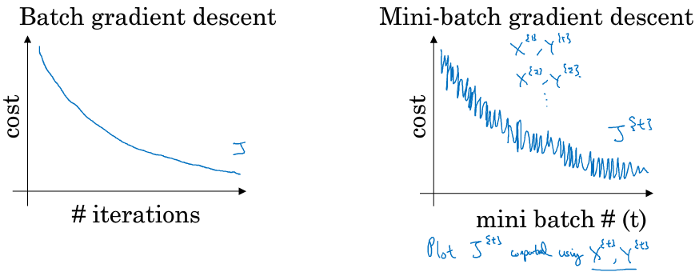
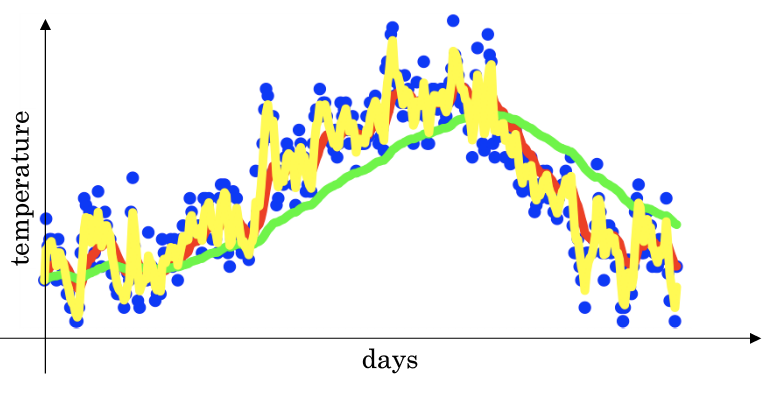
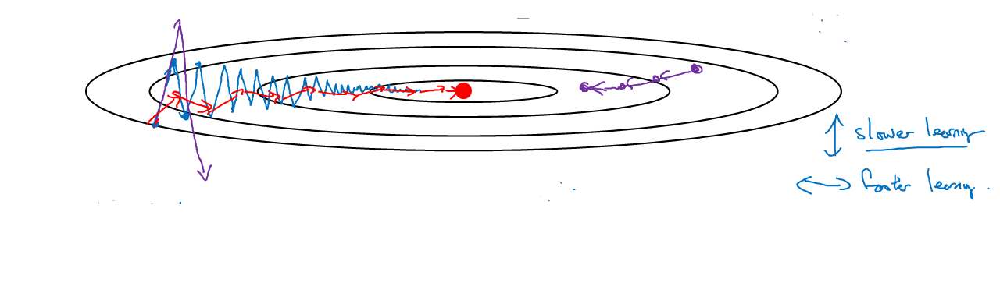
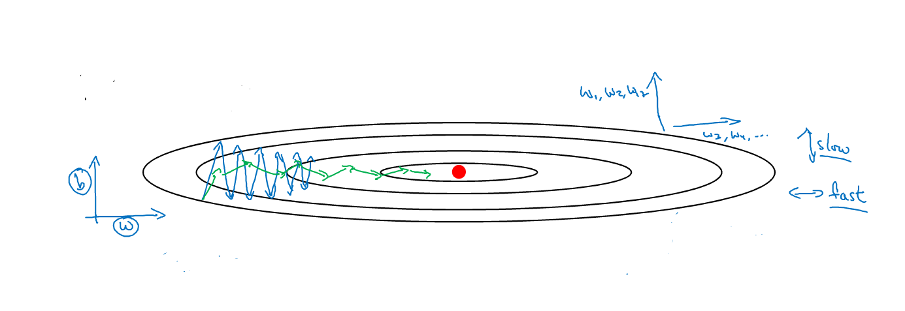

# Optimization

## 1 mini-batch梯度下降

- 提高内存利用率
- 矩阵乘法，提高并行化效率

<p></p>

## 2 指数加权平均

```math
v_t = \beta v_{t-1} + (1-\beta)\theta_t

if \ \beta=0.9

v_{100} = 0.9v_{99} + 0.1\theta_{100}

v_{99} = 0.9v_{98} + 0.1\theta_{99}

v_{98} = 0.9v_{97} + 0.1\theta_{98}

...

v_{100} = 0.1(\theta_{100}+0.9\theta_{99}+0.9^2\theta_{98}+...+0.9^{99}\theta_1)

\lim_{\epsilon \to 0}(1-\epsilon)^{\frac{1}{\epsilon}} = \frac{1}{e}  \approx 0.368
```

指数加权平均相当于把过去1/(1-\beta)进行加权平均

<p></p>

当进行指数加权平均计算时，第一个值v<sub>0</sub>初始化为0，在前期运算时会产生一定的偏差。为了矫正偏差，需要在每一次迭代后用以下式子进行偏差修正

```math
v_t = \frac{v_t}{1-\beta^t}
```

## 3 Momentum

**动量梯度下降：**计算梯度的指数加权平均数，并利用该值来更新参数值

```math
v_{dw} = \beta v_{dw} + (1-\beta)dw

b_{db} = \beta v_{db} + (1-\beta)db

w = w - \alpha v_{dw}

b = b - \alpha v_{db}

\beta = 0.9
```

<p></p>

进行一般的梯度下降将会得到图中的蓝色曲线，而使用Momentum梯度下降时，通过**累加**减少了抵达最小值路径上的摆动，加快了收敛，得到图中红色的曲线

- **当前后梯度方向一致时，Momentum梯度下降能够加速学习**
- **前后梯度方向不一致时，Momentum梯度下降能够抑制震荡**

## 4 RMSProp

**RMSProp：**在对梯度进行指数加权平均的基础上，引入平方和平方根

```math
S_{dw} = \beta s_{dw} + (1-\beta){dw}^2

S_{db} = \beta s_{db} + (1-\beta){db}^2

w = w - \alpha \frac{dw}{\sqrt{s_{dw} + \epsilon}}

b = b - \alpha \frac{db}{\sqrt{s_{db} + \epsilon}}

\epsilon = 10^{-8}
```

\epsilon 用以提高数值稳定度，防止分母太小

<p></p>

## 5 Adam

**Adam** 适用于很多不同的深度学习网络结构，本质上是结合了Momentum和RMSProp

```math
v_{dw} = \beta_1 v_{dw} + (1-\beta_1)dw, v_{db} = \beta_1 v_{db} + (1-\beta_1)db

s_{dw} = \beta_2 s_{dw} + (1-\beta_2){dw}^2, s_{db} = \beta_2 s_{db} + (1-\beta_2){db}^2

v_{dw}^{corrected} = \frac{v_{dw}}{1-\beta_1^t}, v_{db}^{corrected} = \frac{v_{db}}{1-\beta_1^t}

s_{dw}^{corrected} = \frac{s_{dw}}{1-\beta_2^t}, s_{db}^{corrected} = \frac{s_{db}}{1-\beta_2^t}

w = w - \alpha \frac{v_{dw}^{corrected}}{\sqrt{s_{dw}^{corrected}} + \epsilon}

b = b - \alpha \frac{v_{db}^{corrected}}{\sqrt{s_{db}^{corrected}} + \epsilon}

\beta_1 = 0.9, \beta_2 = 0.999, \epsilon=10^{-8}
```

[【deeplearning.ai】深度学习(4)：优化神经网络(2)](https://zhuanlan.zhihu.com/p/34220362)