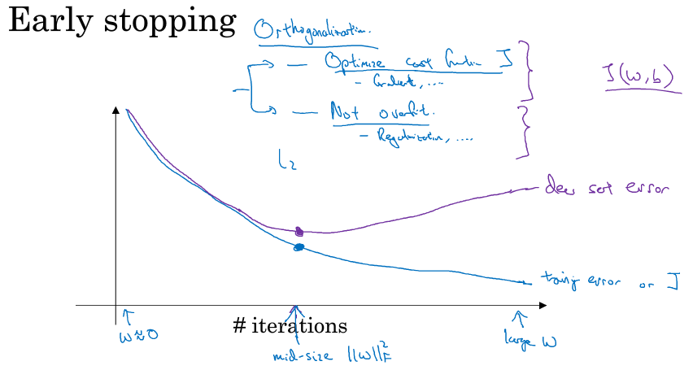

# Regularization

> 从贝叶斯的角度来看，正则化等价于对模型参数引入**先验分布**

**在数据少的时候，先验知识可以防止过拟合**

## 1 L1/L2 regularization

### 1.1 L1

```math
J(w) = \frac{1}{m} \sum_{i=1}^m L(f(x^{(i)}, y^{(i)}) + \frac{\lambda}{m} \sum_{l=1}^L||w^{[l]}||

||w^{[l]}|| = \sum_{i=1}^{n^{[l]}} \sum_{j=1}^{n^{[l-1]}}|w_{ij}^{[l]}|

dw^{[l]} = (from \ backprop) + \frac{\lambda}{m}sgn(w^{[l]})

w^{[l]} = w^{[l]} - \alpha dw^{[l]}
= w^{[l]} - \frac{\alpha \lambda}{m} sgn(w^{[l]}) - \alpha (from \ backprop)
```

当w为正时，更新后的w变小。当w为负时，更新后的w变大——因此它的效果就是**让w往0靠**，使网络中的权重尽可能为0，也就相当于减小了网络复杂度，防止过拟合

### 1.2 L2

```math
J(w) = \frac{1}{m} \sum_{i=1}^m L(f(x^{(i)}, y^{(i)}) + \frac{\lambda}{2m} \sum_{l=1}^L||w^{[l]}||^2

||w^{[l]}||^2 = \sum_{i=1}^{n^{[l]}} \sum_{j=1}^{n^{[l-1]}}(w_{ij}^{[l]})^2

dw^{[l]} = (from \ backprop) + \frac{\lambda}{m}w^{[l]}

w^{[l]} = w^{[l]} - \alpha dw^{[l]}
= (1-\frac{\alpha \lambda}{m})w^{[l]} - \alpha (from \ backprop)
```

**权重衰减**

**更小的权值w**，从某种意义上说，表示网络的复杂度更低，对数据的拟合刚刚好（这个法则也叫做奥卡姆剃刀），而在实际应用中，也验证了这一点，L2正则化的效果往往好于未经正则化的效果

## 2 Dropout

L1、L2正则化是通过修改代价函数来实现的，而Dropout则是通过修改神经网络本身来实现的

```math
l = 3, keep.prob = 0.8

d^3 = np.random.rand(a^3.shape[0], a^3.shape[1]) < keep.prob

a^3 = np.multiply(a^3, d^3)

a^3 /= keep.prob
```

运用了Dropout的训练过程，相当于训练了很多个只有半数隐层单元的神经网络（后面简称为“半数网络”），每一个这样的半数网络，都可以给出一个分类结果，这些结果有的是正确的，有的是错误的。随着训练的进行，大部分半数网络都可以给出正确的分类结果，那么少数的错误分类结果就不会对最终结果造成大的影响。

## 3 Early stopping

<p></p>

理解图片的关键点是训练集和验证集来自同一分布

但是Early stopping方法不稳定的地方是它试图同时优化目标函数和避免过拟合

## 4 Data augmentation

有时候不是因为算法好赢了，而是因为拥有更多的数据才赢了

在深度学习方法中，更多的训练数据，意味着可以用更深的网络，训练出更好的模型

## 5 参考文献

- [正则化方法：L1和L2 regularization、数据集扩增、dropout](https://www.cnblogs.com/peizhe123/p/5114701.html)